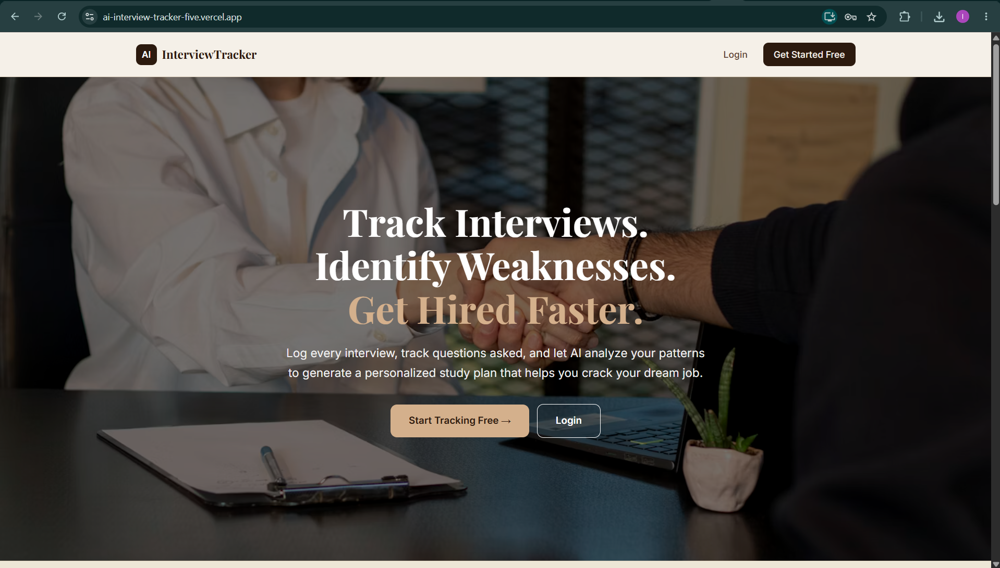
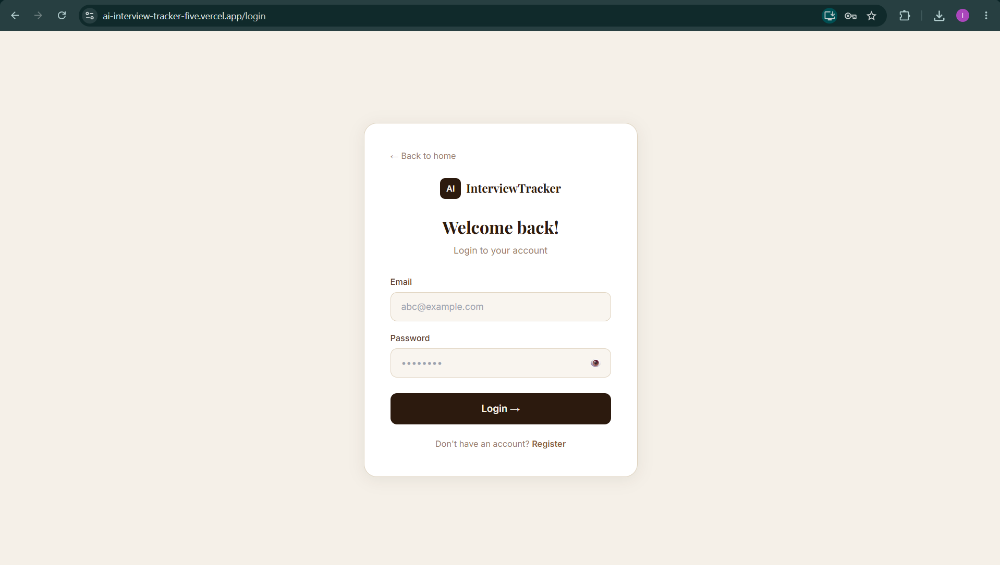
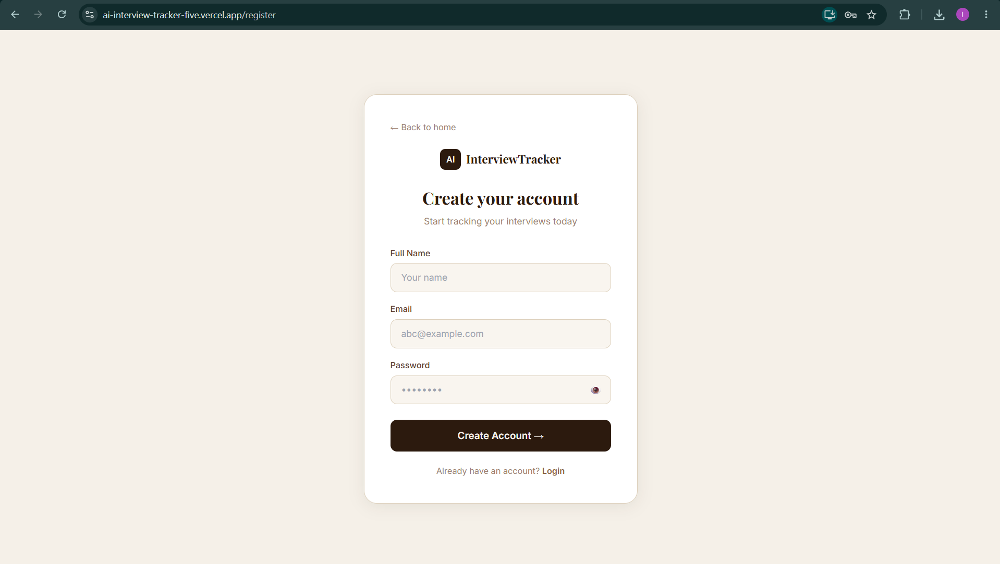
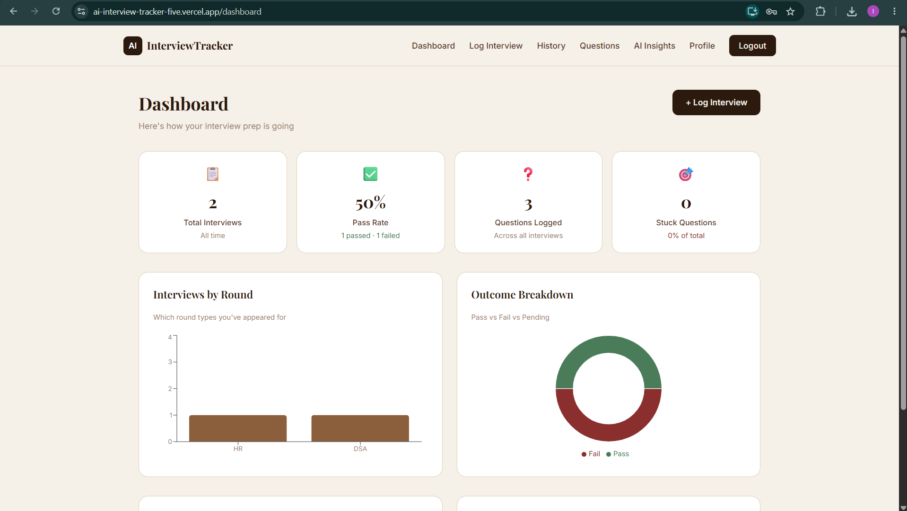
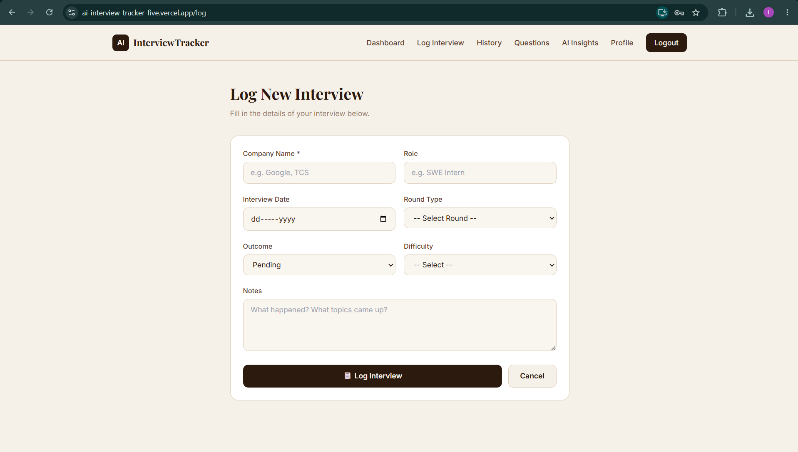
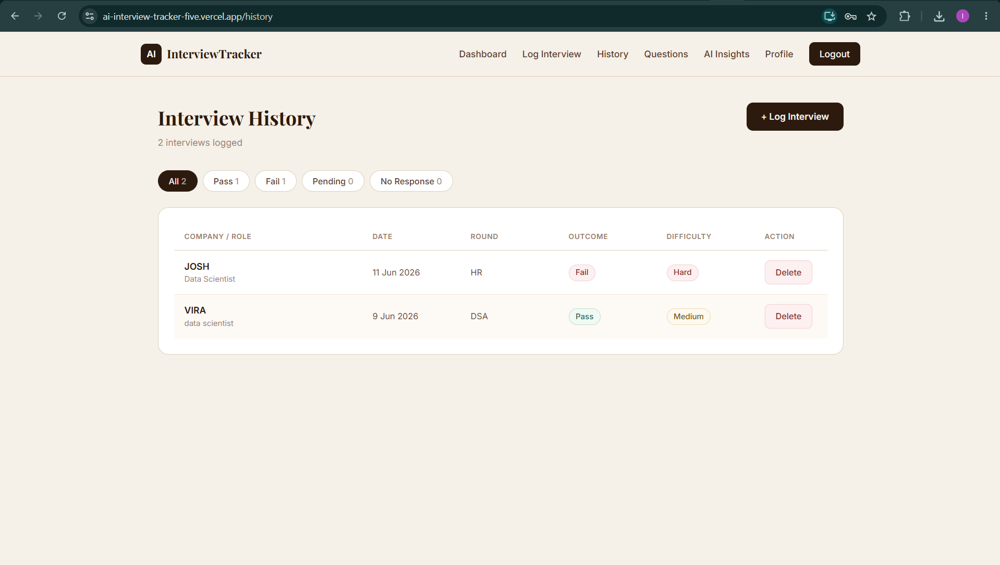
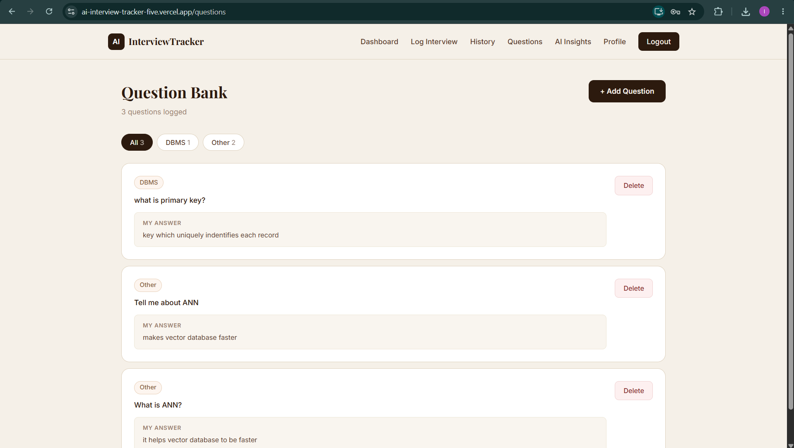
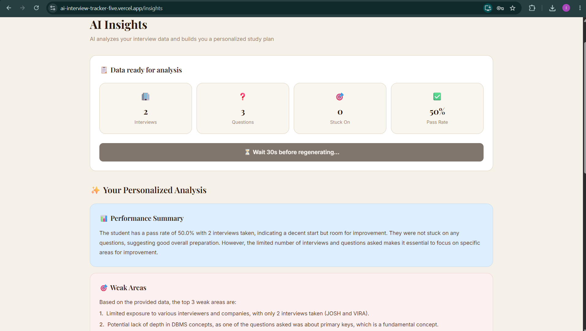
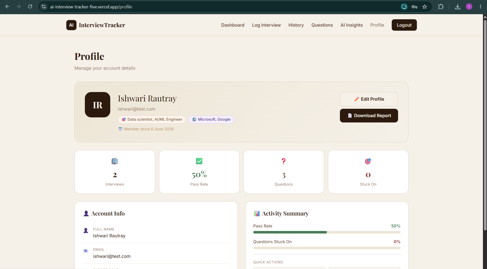

# 🤖 AI Interview Prep Tracker

> *Built by a student, for students — because interview prep deserves better than a spreadsheet.*

A full-stack web application that helps students track interviews, log questions, analyze weak areas, and get AI-powered personalized study plans — all in one place.

---

## 🌐 Live Demo

https://ai-interview-tracker-five.vercel.app 


> ⚠️ First load may take 30–50 seconds (Render free tier cold start). Please be patient!

---

## 🎬 Demo Video

https://drive.google.com/file/d/1J1niVXh14raig0CYhIHrG4TT0VmiAbnP/view?usp=sharing

---

## 📸 Screenshots

### 🏠 Landing Page
 

### 🔐 Login 
 

### 🔐 Register
 

### 📊 Dashboard


### 📋 Log Interview
 

### 📜 Interview History
 

### ❓ Question Bank
 

### 🤖 AI Insights
 

### 👤 Profile & PDF Report
 

---

## 📌 What is this?

**AI Interview Prep Tracker** solves a real problem every student faces:

> *"I keep making the same mistakes in interviews, but I don't know which topics to focus on."*

Most students either forget what happened in past interviews, or don't have a system to track patterns. This app fixes that — log every interview, save every question, and let AI tell you exactly what to study next.

---

## ✨ Features

| Feature | Description |
|---|---|
| 🔐 **JWT Authentication** | Secure register and login with bcrypt password hashing |
| 📋 **Interview Logging** | Log company, role, round type, outcome, difficulty, notes |
| ❓ **Question Bank** | Save questions with topic tags, mark what you were stuck on |
| 📊 **Analytics Dashboard** | Pass rate, round breakdown charts, topic heatmap, weak areas |
| 🤖 **AI Study Plan** | Groq LLaMA 3.3 analyzes your data and gives a personalized 2-week plan |
| 📄 **PDF Export** | Download a beautiful PDF report of your entire interview journey |
| 👤 **Profile Management** | Track target role, target companies, view activity summary |
| 🔒 **Rate Limiting** | Brute force protection on auth endpoints using SlowAPI |
| 📱 **Responsive Design** | Works on mobile with hamburger navigation |

---

## 🛠️ Tech Stack

### Frontend
- **React 18** — Component-based UI
- **Tailwind CSS** — Utility-first styling
- **Recharts** — Interactive bar and pie charts
- **Axios** — HTTP client with JWT interceptors
- **React Router** — Client-side routing with protected routes
- **Context API** — Global authentication state

### Backend
- **FastAPI** — High-performance async Python framework
- **SQLAlchemy** — ORM for database operations
- **python-jose** — JWT token creation and verification
- **Passlib + bcrypt** — Secure password hashing
- **httpx** — Async HTTP client for Groq API calls
- **ReportLab** — Server-side PDF generation
- **SlowAPI** — Rate limiting middleware

### Database & Infrastructure
- **Supabase (PostgreSQL)** — Cloud database with Row Level Security
- **Groq API (LLaMA 3.3 70B)** — Free AI model for insights generation
- **Vercel** — Frontend deployment with CI/CD
- **Render** — Backend deployment with auto-deploy on push

---

## 🗄️ Database Schema

```
users
id (UUID) | name | email | password_hash | target_role | created_at

interviews
id (UUID) | user_id → users | company_name | role
round_type | outcome | difficulty | notes | interview_date

questions
id (UUID) | interview_id → interviews | user_id → users
question_text | topic_tag | my_answer | was_stuck

ai_insights
id (UUID) | user_id → users | weak_areas (JSONB)
recommendations | total_interviews_analyzed
```

---

## 🏗️ Project Structure

```
ai-interview-tracker/
├── frontend/
│   ├── src/
│   │   ├── pages/
│   │   │   ├── Landing.js
│   │   │   ├── Login.js
│   │   │   ├── Register.js
│   │   │   ├── Dashboard.js
│   │   │   ├── LogInterview.js
│   │   │   ├── History.js
│   │   │   ├── Questions.js
│   │   │   ├── Insights.js
│   │   │   └── Profile.js
│   │   ├── components/
│   │   │   └── Navbar.js
│   │   ├── context/
│   │   │   └── AuthContext.js
│   │   ├── services/
│   │   │   └── api.js
│   │   └── styles/
│   │       └── theme.js
│   └── package.json
│
├── backend/
│   ├── routes/
│   │   ├── auth.py
│   │   ├── interviews.py
│   │   ├── questions.py
│   │   ├── dashboard.py
│   │   ├── insights.py
│   │   └── pdf.py
│   ├── models/
│   ├── services/
│   ├── database/
│   ├── main.py
│   ├── requirements.txt
│   └── Procfile
│
└── README.md
```

---

## ⚙️ Run Locally

### Prerequisites
- Python 3.10+
- Node.js 18+
- Git

### 1. Clone the repository

```bash
git clone https://github.com/Ishwari-2006/ai-interview-tracker.git
cd ai-interview-tracker
```

### 2. Backend Setup

```bash
cd backend
python -m venv venv
venv\Scripts\activate        # Windows
pip install -r requirements.txt
python main.py
```

Backend runs at: `http://127.0.0.1:8000`
API docs at: `http://127.0.0.1:8000/docs`

### 3. Frontend Setup

Open a new terminal:

```bash
cd frontend
npm install
npm start
```

Frontend runs at: `http://localhost:3000`

---

## 🔑 Environment Variables

Create a `.env` file inside the `backend/` folder:

```env
DATABASE_URL=your_supabase_postgresql_connection_string
SECRET_KEY=your_secret_key_here
ALGORITHM=HS256
ACCESS_TOKEN_EXPIRE_MINUTES=1440
GROQ_API_KEY=your_groq_api_key_here
```

> 🔒 Never commit your `.env` file. It is already in `.gitignore`.

Get a free Groq API key at: https://console.groq.com

---

## 🔌 API Endpoints

| Method | Endpoint | Description | Auth Required |
|---|---|---|---|
| POST | `/auth/register` | Register new user | ❌ |
| POST | `/auth/login` | Login, get JWT token | ❌ |
| GET | `/auth/me` | Get current user profile | ✅ |
| PUT | `/auth/me` | Update profile | ✅ |
| GET | `/interviews/` | Get all interviews | ✅ |
| POST | `/interviews/` | Create interview | ✅ |
| PUT | `/interviews/{id}` | Update interview | ✅ |
| DELETE | `/interviews/{id}` | Delete interview | ✅ |
| GET | `/questions/` | Get all questions | ✅ |
| POST | `/questions/` | Add question | ✅ |
| DELETE | `/questions/{id}` | Delete question | ✅ |
| GET | `/dashboard/stats` | Get analytics data | ✅ |
| POST | `/insights/generate` | Generate AI study plan | ✅ |
| GET | `/pdf/report` | Download PDF report | ✅ |

---

## 🔒 Security

- Passwords hashed with **bcrypt** — never stored in plain text
- **JWT tokens** for stateless authentication
- **Rate limiting** on login (5/min) and register (3/min) to prevent brute force
- **Input validation** with Pydantic — length limits, type checks, email format validation
- **Row Level Security** enabled on all Supabase tables
- **CORS** restricted to frontend URL in production
- `.env` file never pushed to GitHub

---

## 🎯 Challenges & How I Solved Them

| Challenge | Solution |
|---|---|
| CORS errors between localhost and deployed backend | Added localhost origins for development, Vercel URL for production |
| Groq model deprecated mid-project | Switched from `llama3-8b-8192` to `llama-3.3-70b-versatile` |
| JWT token expiry breaking all API calls | Set 24hr expiry for dev, handled 401 errors gracefully on frontend |
| Free tier memory limits on Render (512MB) | Removed sentence-transformers library which needed 400MB+ RAM |
| Supabase RLS blocking backend queries | Created postgres role policies allowing backend full access |
| Pie chart labels overlapping in dashboard | Removed inline labels, used Legend component below chart instead |

---

## 🚀 Future Improvements

- 🔐 Google OAuth login
- 🧠 Semantic question clustering using sentence embeddings and cosine similarity
- 📧 Email reminders for interview follow-ups
- 📅 Interview scheduling calendar
- 🌐 Community question bank — anonymous sharing of interview experiences
- 📱 React Native mobile app

---

## 👩‍💻 Author

**Ishwari Rautray** — B.Tech IT Student

- 🐙 GitHub: [@Ishwari-2006](https://github.com/Ishwari-2006)
- 💼 LinkedIn: [Ishwari Rautray](https://linkedin.com/in/ishwari-rautray)

---

## 📄 License

This project is created for educational and portfolio purposes.

---

*Built with 💙 · AI Interview Tracker 2026*